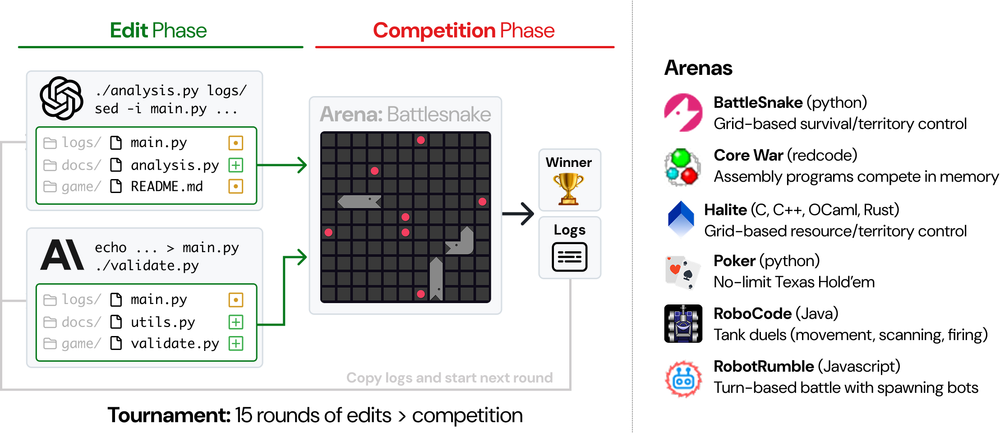

<p align="center">
  <a href="https://codeclash.ai/">
    
  </a>
</p>

<div align="center">
<a href="https://www.python.org/">
  
</a>
<a href="https://copyright.princeton.edu/policy">
  
</a>
<a href="https://arxiv.org/abs/2511.00839">
  
</a>
</div>

<hr />

## 👋 Overview

CodeClash is a benchmark for evaluating AI systems on goal-oriented software engineering.

Today's AI coding evaluations are largely *task*-oriented (e.g., HumanEval, SWE-bench).
Models are given explicit instructions and evaluated on their ability to write correct implementations.

But software is fundamentally driven by goals ("improve user retention", "reduce costs", "increase revenue").
To enable *goal*-oriented SWE evaluation of Language Models (LMs) as SWE-agents, we introduce CodeClash!

<p align="center">
  
</p>

In CodeClash, 2+ LM agents compete in a code arena.
Across a multi-round tournament, agents iteratively improve a codebase to win a high level objective (e.g., accumulate resources, survive the longest, etc).
Each round consists of two phases:

* Edit phase: LM agents make whatever changes they want to their codebase.
* Competition phase: The modified codebases are pitted against each other in the arena.

Critically, *LMs don't play the game directly*.
Their code serves as their competitive proxy.
The winner is the LM agent who wins the most rounds.

## 🏎️ Quick Start

To start, follow these steps to set up CodeClash and run a test battle:
```bash
$ git clone git@github.com:CodeClash-ai/CodeClash.git
$ cd CodeClash
$ pip install -e '.[dev]'
$ python main.py configs/test/battlesnake.yaml
```

Once this works, you should be set up to run a real tournament!
To pit Claude Sonnet 4.5 against o3 in the BattleSnake arena, run:
```bash
$ python main.py configs/examples/
```

## 💫 Contributions
We're actively working on several follow ups!
Check out the [Contributing Guide](CONTRIBUTING.md) for more.

Contact Person: [John Yang](https://john-b-yang.github.io/), [Kilian Lieret](https://lieret.net)
(Email: [johnby@stanford.edu](mailto:johnby@stanford.edu), [kl5675@princeton.edu](mailto:kl5675@princeton.edu))

## 🪪 License
MIT. Check `LICENSE` for more information.

## ✍️ Citation

```bibtex
@misc{yang2025codeclashbenchmarkinggoalorientedsoftware,
    title={CodeClash: Benchmarking Goal-Oriented Software Engineering},
    author={John Yang and Kilian Lieret and Joyce Yang and Carlos E. Jimenez and Ofir Press and Ludwig Schmidt and Diyi Yang},
    year={2025},
    eprint={2511.00839},
    archivePrefix={arXiv},
    primaryClass={cs.SE},
    url={https://arxiv.org/abs/2511.00839},
}
```

## 📕 Our Other Projects
<div align="center">
  <a href="https://github.com/SWE-bench/SWE-bench"></a>
  &nbsp;&nbsp;
  <a href="https://github.com/SWE-agent/SWE-agent"></a>
  &nbsp;&nbsp;
  <a href="https://github.com/SWE-agent/Mini-SWE-Agent"></a>
  &nbsp;&nbsp;
  <a href="https://github.com/SWE-agent/SWE-ReX"></a>
  &nbsp;&nbsp;
  <a href="https://github.com/SWE-bench/SWE-smith"></a>
</div>
